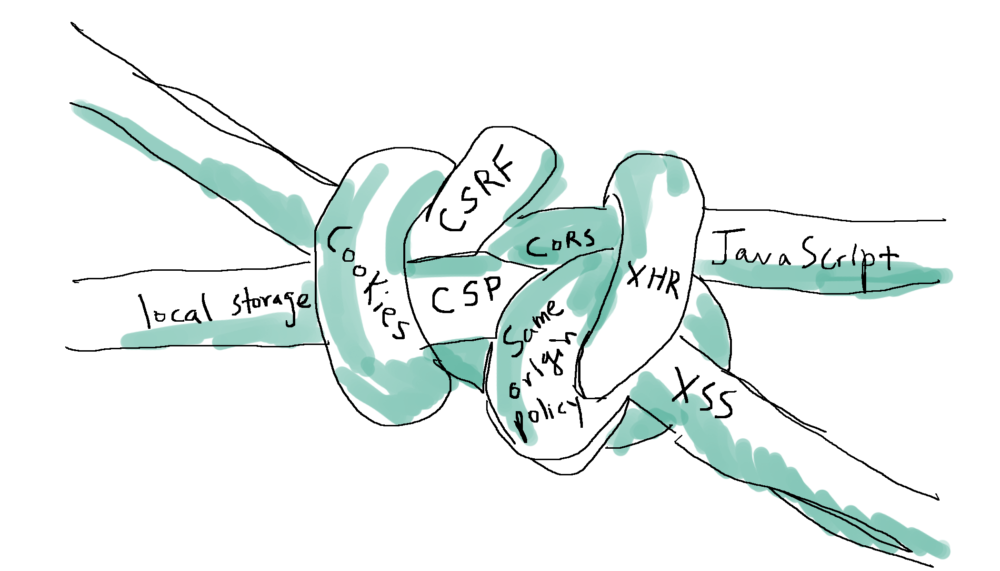

## Hosts
### sudo nano /etc/hosts (macos)
```
192.168.1.4 bank.com
192.168.1.4 api.bank.com
192.168.1.4 evil.com
192.168.1.4 abc.com
192.168.1.4 other.com
```

## Read
#### https://learn.javascript.ru/cookie
#### https://learn.javascript.ru/fetch-crossorigin
#### https://ru.stackoverflow.com/questions/1069331/%D0%A7%D1%82%D0%BE-%D1%82%D0%B0%D0%BA%D0%BE%D0%B5-access-control-allow-credentials
#### https://stackoverflow.com/questions/46288437/set-cookies-for-cross-origin-requests
#### https://grishaev.me/cors/
#### https://webdevblog.ru/chto-takoe-cors/
#### https://jakearchibald.com/2021/cors/
#### https://flagstudio.ru/blog/http-metody-status-cody-zagolovky
#### https://medium.com/nuances-of-programming/%D0%BA%D0%BE%D0%BC%D0%BF%D1%8C%D1%8E%D1%82%D0%B5%D1%80%D0%BD%D0%B0%D1%8F-%D0%BD%D0%B0%D1%83%D0%BA%D0%B0-%D0%BD%D0%B0%D0%B3%D0%BB%D1%8F%D0%B4%D0%BD%D0%BE-cors-20a97786c18c
#### https://habr.com/ru/company/macloud/blog/553826/
